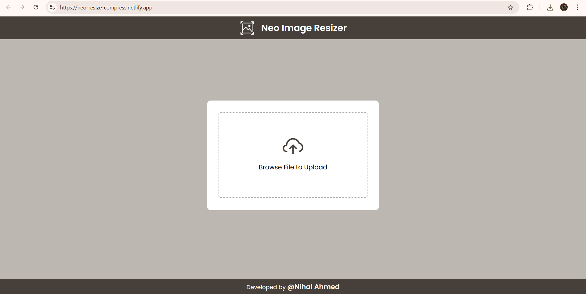

# 🖼️ Image Resizer Web App

A simple and responsive image resizer built using **HTML**, **CSS**, and **JavaScript**. Upload an image, set your preferred dimensions, maintain the aspect ratio if needed, reduce image quality, and download the resized image instantly.

 <!-- Optional: Replace with your own screenshot -->

## 🚀 Features

- 📤 Upload any image (`.jpg`, `.jpeg`, `.png`, etc.)
- ✂️ Resize to custom width and height
- 🔒 Option to lock aspect ratio
- 🧪 Option to reduce image quality (saves size)
- 📥 Download the resized image in one click
- 💡 Clean and minimal user interface

## 🛠️ Technologies Used

- HTML5
- CSS3
- JavaScript
- Canvas API
- Google Fonts (Poppins)

## 📦 How to Use

1. **Clone this repository**
   ```bash
   git clone https://github.comnihalahmed07/Resize-and-Compress-Images.git
   cd Resize-and-Compress-Images
